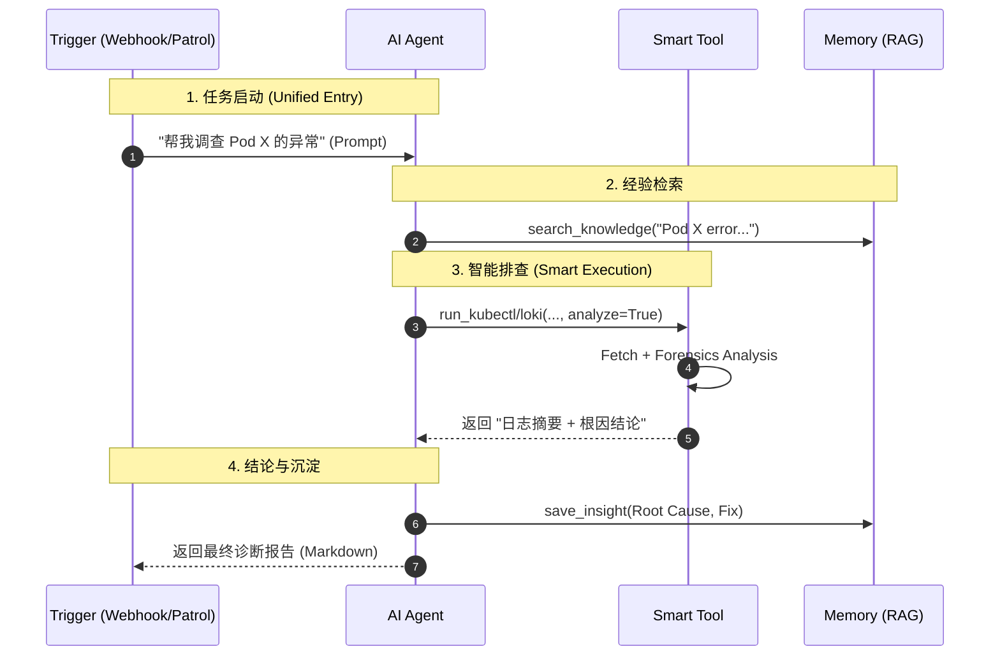

# 系统架构与工作流程 (System Architecture & Workflows)

> **Generated**: 2026-02-12
> **Based on**: v0.6.0 (Unified Agentic Architecture + Smart Tools)

本文档描述了 K8s AIOps Agent 的核心架构。我们采用 **"Unified Agentic Architecture" (统一智能体架构)** 与 **"Smart Tools" (智能工具)** 设计，旨在彻底消除主动巡检与被动告警的逻辑割裂，并优化数据流转效率。

## 1. 核心设计理念 (Core Concepts)

- **统一入口 (Unified Entry)**: 无论是被动接收的 **Webhook 告警**，还是主动发起的 **Patrol 巡检**，在系统内部都被视为同构的 **"Investigation Task"**。
- **单一核心 (Single Brain)**: **LangGraph Agent** 是唯一的决策中枢。PatrolService 不再包含任何排查逻辑，可以理解为它只是一个“定时按门铃的人”。
- **智能工具 (Smart Tools)**: 工具具备原子化的 AI 分析能力，负责“获取+分析”的闭环，避免 Raw Logs 传输给 Agent。

---

## 2. 系统架构图 (System Architecture)

```mermaid
graph TD
    %% Styling
    classDef trigger fill:#e1f5fe,stroke:#01579b,stroke-width:2px;
    classDef core fill:#e8f5e9,stroke:#2e7d32,stroke-width:2px;
    classDef infra fill:#fff3e0,stroke:#ef6c00,stroke-width:2px;
    
    subgraph Triggers [Event Sources]
        direction TB
        User[User Chat]:::trigger
        Webhook[Alertmanager]:::trigger
        Patrol[Patrol Service]:::trigger
    end

    subgraph Backend [Backend Core]
        direction TB
        
        subgraph AgentBrain [AI Agent Kernel]
            Agent[LangGraph Agent]:::core
        end
        
        subgraph SmartTools [Smart Tool Layer]
            direction LR
            LokiTool[Smart Loki Query]:::core
            K8sTool[Smart Kubectl]:::core
            Forensics[Forensics Engine]:::core
        end
    end

    subgraph Infra [Infrastructure]
        K8s[Kubernetes]:::infra
        Loki[Loki Logs]:::infra
        LLM[LLM Provider]:::infra
    end

    %% Flow
    User -->|Message| Agent
    Webhook -->|Task (Passive)| Agent
    Patrol -->|Task (Active)| Agent
    
    Agent -->|Call| LokiTool
    Agent -->|Call| K8sTool
    
    %% Internal Smart Logic
    LokiTool -->|Fetch| Loki
    LokiTool -.->|Raw Data| Forensics
    Forensics -->|Extract| LLM
    Forensics -->|Structured Report| LokiTool
    
    LokiTool -->|Result: Logs + Analysis| Agent
```

---

## 3. 统一调查工作流 (Unified Investigation Workflow)

**核心变更**: 主动巡检 (Patrol) 与 被动调查 (Alert) 彻底合并。

| 特性 | 旧架构 (Legacy) | 新架构 (Unified) |
| :--- | :--- | :--- |
| **触发方式** | Patrol 独立运行 Loop | Patrol 仅负责**创建任务** |
| **排查逻辑** | Patrol 硬编码 Python 逻辑 | **复用 Agent 核心逻辑** |
| **工具使用** | Patrol 只能调 LogForensics | Agent 可调 K8s, Loki, SearchKnowledge |
| **结果沉淀** | 仅生成 HTML 报告 | 自动生成 Insight 并存入**知识库** |

### 统一序列流 (Unified Sequence)

不管是 `Alert` 还是 `Patrol`，进入 `Agent` 后流程完全一致：



---

## 4. 智能工具数据流 (Smart Tool Data Flow)

针对 "Token 效率" 的专项优化。

1. **Agent 指令**: `run_loki_query(query="{app='payment'}", analyze=True)`
2. **Tool 内部执行**:
    - 查询 Loki 获得 5MB 日志。
    - **内部**调用 `LogForensicsService` (LangExtract) 进行分析。
    - 生成 JSON 结论: `{ "cause": "OOM", "fix": "Limit += 500Mi" }`
3. **返回 Agent**:
    - `Summary`: "Logs analyzed. Found OOM."
    - `Analysis`: JSON Data
    - `Preview`: "Error: Java heap space... (truncated)"
4. **Token 节省**: Agent 永远不会“看到”那 5MB 的原始日志，只看到几百 Token 的分析结果。
